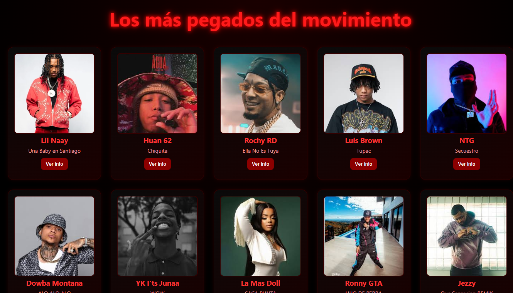

# Catalogo de Artistas

## 📌 Descripción
Este proyecto consiste el un catalogo de diferentes artistas dominicanos usando un API para que salgan diferentes canciones de estos artistas

## 🛠️ Tecnologías Utilizadas
- **Lenguajes:** HTML, CSS, JAVASCRIPT
- **API usada:** Itunes Search Api
- **Entorno de desarrollo (IDE):** Visual Studio Code  

## ▶️ Uso o Ejecución
Para visualizar el proyecto localmente, sigue estos pasos:

1. Descarga o clona el repositorio desde GitHub.
2. Localiza el archivo `index.html` en la carpeta raíz.
3. Haz doble clic en el archivo para abrirlo en tu navegador web preferido.
4. Presiona los botones para ver las canciones de los artistas

## 🖼️ Imágenes de la ejecución del proyecto
Aquí se pueden observar el proyecto hecho:

### Catalogo de artistas!

- **Nivel:** Secundaria Técnico Profesional
- **Módulo Formativo:** Desarrollo Web
- **Curso / Sección:** 4to D
- **Año escolar:** 2025-2026
